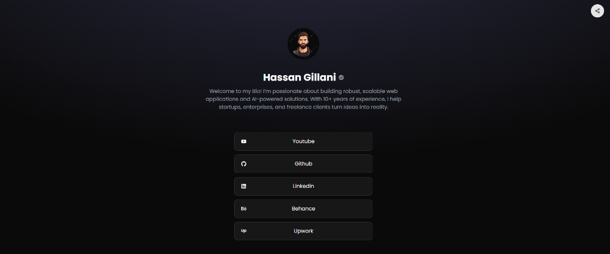

# MySocials

MySocials is an open-source **Link-in-Bio** tool designed to simplify the management of social media links. Built with **Next.js (App Router)**, **Shadcn UI**, **Tailwind CSS**, and **MongoDB**, this project provides a seamless way to share multiple links, including professional profiles, social networks, and messaging apps, all from a single beautiful landing page.



## ✨ Features

- **🎨 Customizable Profiles**: Personalize your page with a bio, profile picture, and verified badge.
- **🔗 Multiple Link Categories**: Organize links into Social, Professional, Creative, Storefront, and Messaging.
- **🔒 Private Links**: Share exclusive content protected by an Access Key.
- **🛠️ Admin Dashboard**:
    - **Dynamic Site Config**: Update the landing page Title, Description, Site Name, and GitHub links directly from the admin panel.
    - **User Management**: Manage your profile and links effortlessly.
- **⚡ Tech Stack**:
    - **Framework**: Next.js 16 (Turbopack)
    - **Styling**: Tailwind CSS & Shadcn UI
    - **Database**: MongoDB (Mongoose)
    - **Authentication**: Clerk
    - **Icons**: Lucide React & React Icons

## 🚀 Getting Started

Follow these steps to run the project locally.

### Prerequisites
- Node.js (v18+)
- MongoDB Atlas account (or local instance)
- Clerk account

### Installation

1.  **Clone the repository:**
    ```bash
    git clone https://github.com/HassanGilani11/socialbio.git
    cd socialbio
    ```

2.  **Install dependencies:**
    ```bash
    npm install
    # or
    pnpm install
    ```

3.  **Environment Setup:**
    Create a `.env.local` file in the root directory and add the following keys:

    ```env
    NEXT_PUBLIC_CLERK_PUBLISHABLE_KEY=pk_test_...
    CLERK_SECRET_KEY=sk_test_...
    
    NEXT_PUBLIC_CLERK_SIGN_IN_URL=/sign-in
    NEXT_PUBLIC_CLERK_SIGN_UP_URL=/sign-up
    NEXT_PUBLIC_CLERK_AFTER_SIGN_IN_URL=/dashboard/manage
    NEXT_PUBLIC_CLERK_AFTER_SIGN_UP_URL=/dashboard/manage

    MONGODB_URI=mongodb+srv://<username>:<password>@cluster.mongodb.net/mysocials
    ```

4.  **Run the development server:**
    ```bash
    npm run dev
    ```

5.  **Open the app:**
    Visit `http://localhost:3000` in your browser.

## 🛠️ Admin Configuration

The application includes a built-in **Admin Panel** (`/admin`) to configure global site settings.
- **Hero Title & Description**: Customize the landing page text.
- **Site Name**: Change the logo text (e.g., "MySocials").
- **GitHub Links**: Update the "Contribute" button link and text.

*Note: The admin route is protected and requires authentication.*

## 🤝 Contribution

Contributions are welcome!
1.  Fork the repository.
2.  Create a feature branch (`git checkout -b feature/AmazingFeature`).
3.  Commit your changes (`git commit -m 'Add some AmazingFeature'`).
4.  Push to the branch (`git push origin feature/AmazingFeature`).
5.  Open a Pull Request.

## 📜 License

Distributed under the MIT License. See `LICENSE` for more information.

## 👤 Author

**Syed Hassan**
- GitHub: [@HassanGilani11](https://github.com/HassanGilani11)
- Website: [MySocials Preview](https://mysocialz.vercel.app/syedhassan)
